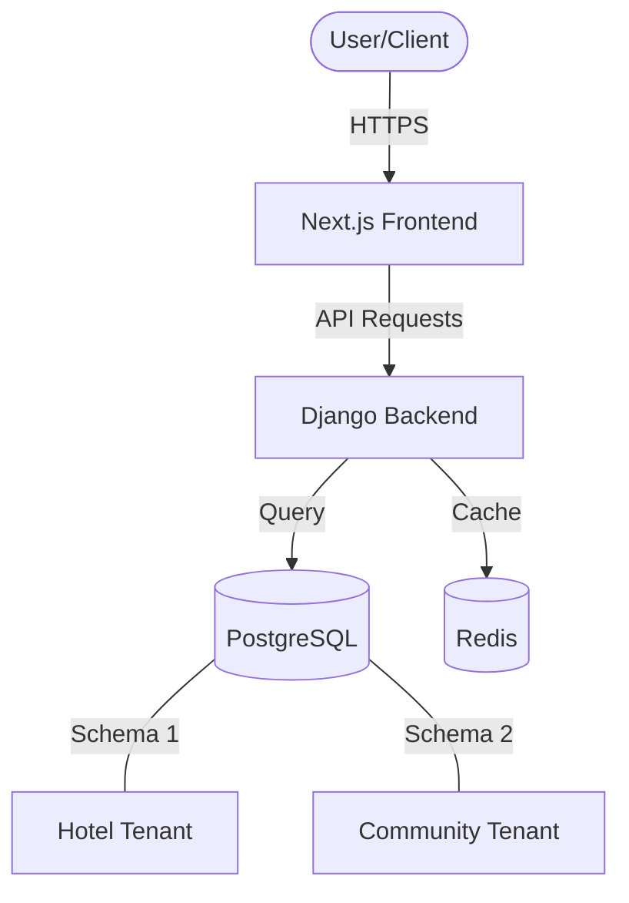

# System Architecture: Ma'ed SaaS

This document outlines the high-level architecture of the **Ma'ed SaaS** platform, providing insight into the engineering decisions behind the project.

## 🏛️ Overall Architecture
The platform follows a decoupled **Client-Server** architecture:
- **Backend**: A robust Django REST Framework (DRF) API.
- **Frontend**: A highly interactive Next.js 16 SPA (Single Page Application).

## 🏢 Multi-Tenancy Strategy
We utilize a **Shared Database, Separate Schema** approach.
- **Mechanism**: Each tenant is assigned a unique schema in PostgreSQL.
- **Middleware**: The `TenantMainMiddleware` identifies the tenant based on the subdomain (e.g., `hotel.maed-saas.com`) and sets the database search path dynamically.
- **Benefits**:
    - Complete data isolation at the DB layer.
    - Simplified migrations across all tenants.
    - Ability to backup individual tenants.

## 🔐 Security Layers
1. **Authentication**: Stateless JWT (JSON Web Tokens) with a 60-minute access lifetime and 24-hour refresh window.
2. **Authorization**: Custom DRF permissions (`IsOwner`, `IsFamilyAdmin`, `IsCustomerOrAdmin`) to ensure strict access control.
3. **Data Security**: Encryption for sensitive fields and secure handling of PII (Personally Identifiable Information).
4. **Hardening**: Content-Security-Policy (CSP), X-Frame-Options, and HSTS headers are enforced via custom middleware.

## ⚡ Monetization Logic (Feature Gating)
The system uses a **Middleware-First** gating strategy:
- Requests to premium modules (e.g., `/api/ai/`) are intercepted by the `FeatureGateMiddleware`.
- The middleware cross-references the tenant's `SubscriptionPlan` with the requested `AppFeature`.
- A **3-day grace period** is factored into the expiry logic to maintain service continuity during bank transfer delays.

## 🌐 Localization (i18n)
Ma'ed SaaS uses a hybrid localization approach:
- **Static Content**: Handled via Next.js `intl` and Django `gettext`.
- **Dynamic Content**: Database fields are translated using `django-modeltranslation`, allowing for multi-language product names and descriptions (English, Amharic, Oromo, Tigrinya).

---

### Key Engineering Decisions
- **Next.js Server Components**: Used for SEO-critical pages (Landing, Login) while keeping heavy dashboard logic in Client Components.
- **PostgreSQL JSONB**: Used for `ColumnConfig` and `features` to allow for flexible, no-code schema extensions without altering the physical DB structure.
